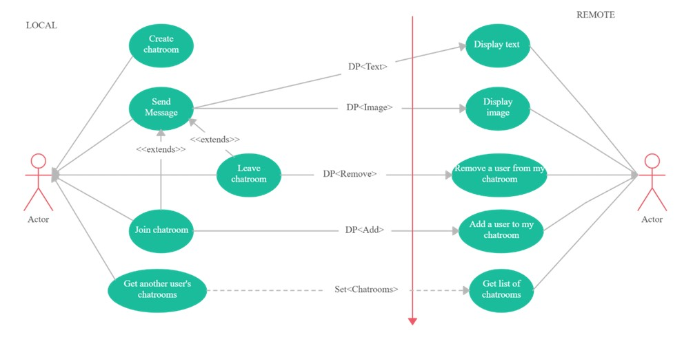
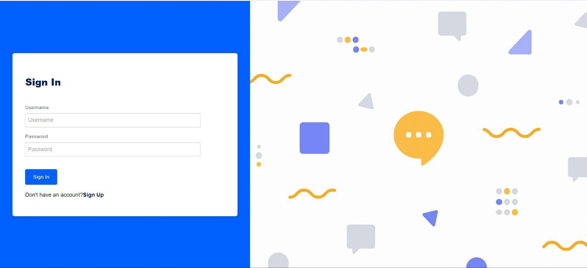
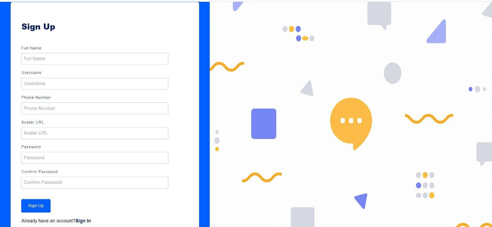
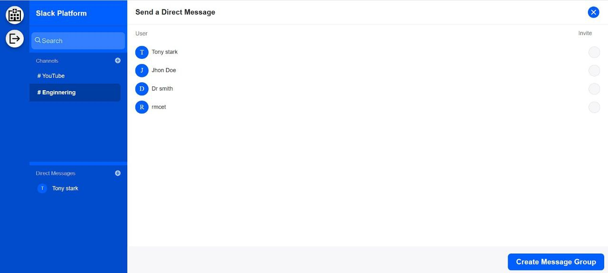
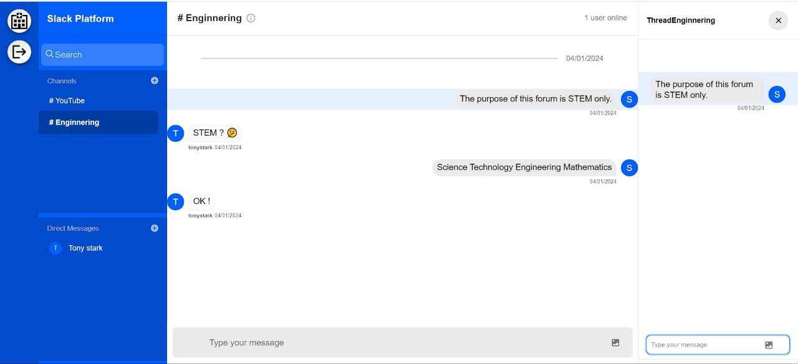

# SLACK Clone

🌟 **Searchable Log of All Communication & Knowledge** (SLACK) is a web-based platform that allows users to communicate and collaborate with each other in real time. Users can create and join channels for different topics, send and receive text, audio, and video messages, share files and documents, and customize their emojis and notifications

💡 A slack clone web application can be built using various technologies, such as React, Firebase, Stream etc.

💻 A slack clone web application can be a useful and fun project for learning web development and creating a team messenger site. 

# Technologies
</>**Frontend**: HTML, CSS & JS
🖧**Backend**: Node.js, Mongodb, Firebase Javascript SDK, Socketio

# Design

# Implementation

**Login**

**Signup**

**Dashboard**

**Chat-Rooms**

